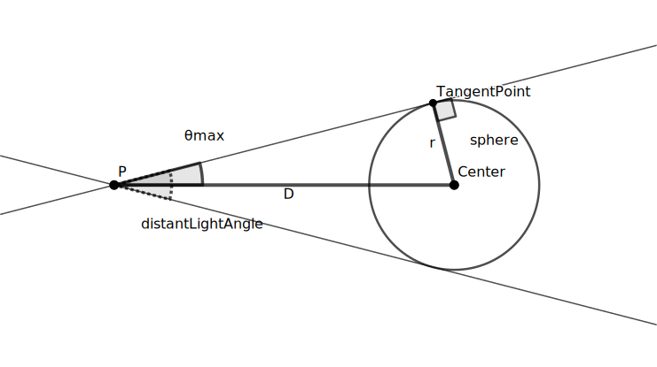

# Normalizing Distant Lights - In Depth                         {#normdist}

Recall that when normalizing a light, we divide it's luminance, $L_V$,
by a $sizeFactor$ which depends on the shape properties of the light - ie,
assuming that the exposure is zero:

$$
    L_V = Intensity / sizeFactor
$$

For distant lights, we defined $sizeFactor$ to be:

$$
    sizeFactor(\theta_{max}) =
    \begin{cases}
        1,                                & \text{if} \quad \theta_{max} = 0              \\
        sin(\theta_{max})^2 * \pi,        & \text{if} \quad 0<\theta_{max} \leq \pi / 2   \\
        ( 2 - sin(\theta_{max})^2) * \pi, & \text{if} \quad \pi/2 < \theta_{max} \leq \pi
    \end{cases}
$$

...where we define $\theta_{max}$ as:

$$
    \theta_{max} = toRadians(distantLightAngle) / 2
$$

We claimed that using this formula meant the following two properties held:

- #### Property 1: Intensity = Illuminance

  When normalize is enabled, the received illuminance from this light on a
  surface normal to the light's primary direction is held constant when angle
  changes, and the "intensity" property becomes a measure of the illuminance,
  expressed in lux, for a light with 0 exposure.

- #### Property 2: Proportional to surface area of a distant sphere

  If we assume that our distant light is an approximation for a "very far"
  sphere light (like the sun), then (for 0 < $\theta_{max} \leq \pi / 2$), this
  definition agrees with the definition used for area lights - ie, the total
  power of this distant sphere light is constant when the "size" (ie,
  $distantLightAngle$) changes, and our $sizeFactor$ is proportional to the total
  surface area of this sphere.

This section demonstrates why these properties hold, and how these formulas were
derived.

---------------------------------------------------------------

### Property 1: Intensity = Illuminance

We wish to demonstrate that when normalize is on and our $sizeFactor$ is defined
as above, then intensity becomes a measure of incoming illuminance, $E_V$:

$$
    Intensity = E_V
$$

To calculate $E_V$, we integrate the luminance, $L_V$, over all the solid angles $\Omega$ incoming from the light on a surface normal to the light - in this case, the spherical cap defined by $\theta_{max}$, denoted $\Omega_{\theta_{max}}$:

$$
    E_V = \int\limits_{\Omega_{\theta_{max}}} L_V \, cos(\theta) \, d\Omega
$$

By defining our spherical cap $\Omega_{\theta_{max}}$ in terms of polar
coordinates $(\theta, \phi)$, where $\theta \leq \theta_{max}$ (and
assuming $0 < \theta_{max} \leq \pi / 2$), we have:

$$
    E_V = \underset{\phi\quad}{\int_0^{2\pi}}
            \underset{\theta\quad}{\int_0^{\theta_{max}}}
                L_V \, cos(\theta) \, sin(\theta) \, d\theta \, d\phi
$$

Our distant light is defined such that it is a constant value for all incoming
directions on $\Omega_{\theta_{max}}$, and nothing is dependent on $\phi$, so:

$$
    E_V = L_V \, 2\pi \underset{\theta\quad}{\int_0^{\theta_{max}}}
            cos(\theta) \, sin(\theta) \, d\theta
$$

$$
    E_V = L_V \, 2\pi {\left[ \frac{sin^2(\theta)}{2} \right]}_0^{\theta_{max}}
$$

$$
    E_V = L_V \, \pi sin^2(\theta_{max})
$$

Next, we substitute our formula for $L_V$ for a normalized light:

$$
    L_V = Intensity / sizeFactor(\theta_{max})
$$

to get:

$$
    E_v * sizeFactor(\theta_{max}) = Intensity * \pi sin^2(\theta_{max})
$$

...and we can see that if we use our desired definition of
$sizeFactor(\theta_{max}) = \pi \, sin^2(\theta_{max})$, then

$$
    E_V = Intensity
$$

---------------------------------------------------------------

### Property 2: Proportional to surface area of a distant sphere

To see that the same formula for $sizeFactor$ is equivalent to that used for
a sphere area light, consider that for a sphere light with radius $r$ that is
distance $D$ away from a point $P$ the relationship between $\theta_{max}$ (the
half-angle of the circular arc subtended by the sphere) $r$ and $D$ is:

$$
    sin(\theta_{max}) = r / D
$$

So, since the surface area of a sphere is $4\pi r^2$, for a "normal" sphere
area light we have:

$$
    sizeFactor(Light) = surfaceArea(light) = 4\pi D^2 sin^2(\theta_{max})
$$

Thus, for a sphere light, the $sizeFactor$ is proportional to
$sin^2(\theta_{max})$, with a scaling factor which is a property of the distance
of the light.

For our distant light, we assume that the distance $D$ is so much larger than
our local coordinate system measurements that, when calculating the direction
between a local point $\bold{P}$ and the center of our distant sphere,
$\bold{C}$, we can effectively ignore the local coordinates $\vec{P}_{Local}$,
and assume the direction is constant.

However, if we assume when we change $\theta_{max}$ what we are "really" doing
is scaling up the radius $r$ of our sphere while keeping it's center in the
same position, we can apply the above equation.  In our distant light case,
since we do not have a definite value for $D$, we cannot use this to give us
a complete formula for $sizeFactor(\theta_{max})$ - however, it does demonstrate
that any formula of the form

$$
    sizeFactor(\theta_{max}) = K \, sin^2(\theta_{max})
$$

for some constant $K$ will be proportional to the surface area of such a sphere,
and therefore also hold power constant for this sphere.

---------------------------------------------------------------

### A note on distant lights with $\theta_{max} > \pi / 2$

To this point, I've ignored the possibility of distant lights that emit from
more than a hemisphere - ie, where $distantLightAngle > 180°$, or
$\theta_{max} > \pi / 2$.

#### Property 1
To derive a formula for such angles via **Property 1** we first assume that rays
coming from behind the receiving plane still contribute to total illuminance -
transparent and translucent materials are possible, after all!  Then the "true"
formula for $E_V$ becomes:

$$
    E_V = \int\limits_{\Omega_{\theta_{max}}} L_V \, |cos(\theta)| \, d\Omega
$$

For $0 < \theta_{max} \leq \pi / 2$, this is identical to the above version, as
$cos(\theta) = |cos(\theta)|$ on this domain.  For
$\pi / 2 < \theta_{max} \leq \pi$, we need to split the polar-coordinate
integral at $\theta = \pi / 2$, and we get:

$$
\begin{aligned}
    E_V = \quad &\underset{\phi\quad}{\int_0^{2\pi}}
                \underset{\theta\quad}{\int_0^{\pi/2}}
                    L_V \, cos(\theta) \, sin(\theta) \, d\theta \, d\phi
    \newline
          + & \underset{\phi\quad}{\int_0^{2\pi}}
                \underset{\theta\quad}{\int_{\pi/2}^{\theta_{max}}}
                    L_V \, (-cos(\theta)) \, sin(\theta) \, d\theta \, d\phi
\end{aligned}
$$

$$
    E_V = L_V \, \pi - L_V \, 2\pi
        \underset{\theta\quad}{\int_{\pi/2}^{\theta_{max}}}
            cos(\theta) \, sin(\theta) \, d\theta
$$

$$
    E_V = L_V \, \pi \left(
        1 - 2 {\left[
                    \frac{sin^2(\theta)}{2} \right]}_{\pi/2}^{\theta_{max}}
               \right)
$$

$$
    E_V = L_V \, \pi \left( 2 - sin^2(\theta_{max}) \right)
$$

Thus, if $E_V = Intensity$ and $L_V = Intensity / sizeFactor(\theta_{max})$,

$$
    sizeFactor(\theta_{max}) = \pi \left( 2 - sin^2(\theta_{max}) \right),
        \quad \text{if } \pi/2 < \theta \leq \pi
$$

#### Property 2

**Property 2** doesn't really apply when  $\theta_{max} > \pi / 2$, as our
assumption that a distant light is an approximation of far spherical light
breaks down, because there's no way such a light would result in incident light
coming in from more than a hempisphere, but less than the complete sphere.

But our $sizeFactor(\theta_{max})$ function is now at least well defined and
continuous in this region, even if we no longer have an appropriate physical
light analogy for this domain.
